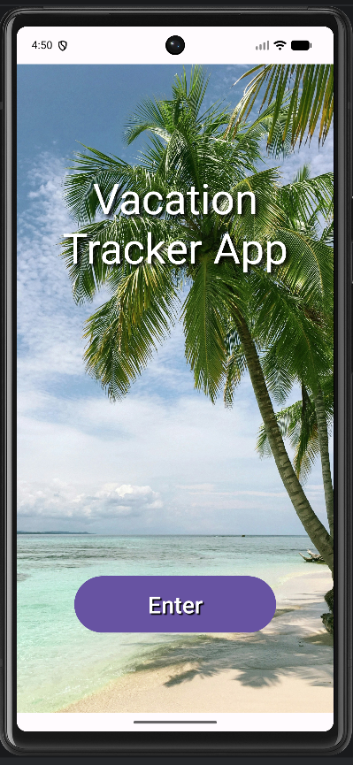
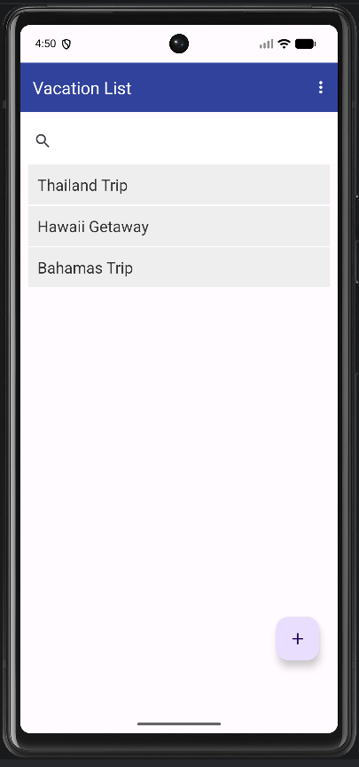
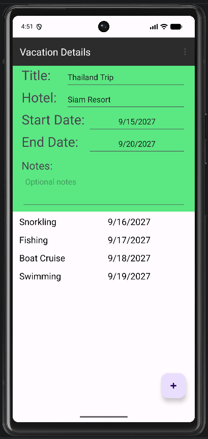
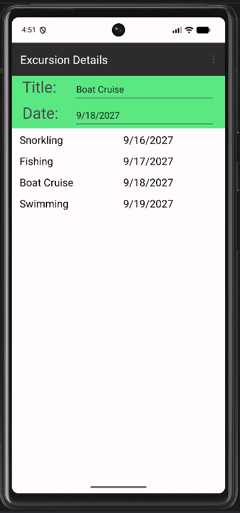
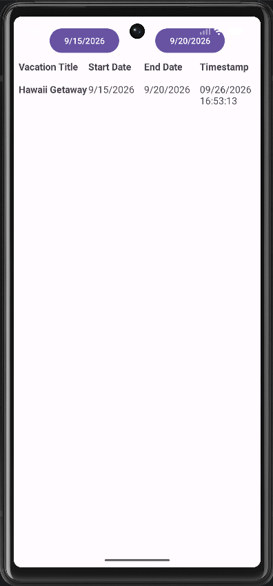

# Vacation Tracker App

The Vacation Tracker App is a native Android application for organizing vacations and their associated excursions. Users can create and manage trips, track lodging and travel dates, add excursions, search saved vacations, generate date-based reports, and schedule reminders for important trip events.

The application was built in Java using Android Studio, with Room providing local SQLite database persistence.

## Screenshots

<p align="center">
  
  
  
</p>

<p align="center">
  
  
</p>

## Features

### Vacation Management

- Create, update, and delete vacations
- Store vacation titles, lodging information, dates, and notes
- View saved vacations in a RecyclerView
- Search vacations by title
- Prevent deletion of vacations that still contain associated excursions
- Share vacation details through Android's native sharing system

### Excursion Management

- Add excursions to individual vacations
- Edit and delete existing excursions
- Associate multiple excursions with a single vacation
- Validate excursion dates against the parent vacation's travel dates

### Date Validation

The application validates your travel data before saving it.

- Vacation end dates cannot occur before vacation start dates
- Excursion dates must fall within the associated vacation's date range
- Invalid date selections generate feedback before the record is saved

### Reminders

Vacation Tracker uses Android scheduling components to support reminders for:

- Vacation start dates
- Vacation end dates
- Excursion dates

The reminder system uses `AlarmManager`, `PendingIntent`, `BroadcastReceiver`, and Android notifications.

### Reports

Users can also generate vacation reports for a selected date range. Matching vacations are displayed with their start and end dates along with a report timestamp.

### Sample Data

The application includes optional sample vacation and excursion data for demonstration and testing.

---

## Tech Stack

| Technology | Usage |
|---|---|
| Java | Application logic |
| Android SDK | Native Android development |
| Android Studio | Development environment |
| Room | Local database persistence |
| SQLite | Underlying relational database |
| RecyclerView | Vacation, excursion, and report lists |
| Material Components | Android UI elements |
| Gradle | Build and dependency management |
| AlarmManager | Scheduled reminders |
| Android Intents | Screen navigation and sharing |

---

## Architecture

Vacation Tracker separates persistent data access from the application's UI through a repository-based structure.

```text
UI
│
├── Activities
│   ├── MainActivity
│   ├── VacationList
│   ├── VacationDetails
│   ├── ExcursionDetails
│   └── ReportActivity
│
├── RecyclerView Adapters
│   ├── VacationAdapter
│   ├── ExcursionAdapter
│   └── ReportAdapter
│
└── Repository
    │
    ├── VacationDAO
    ├── ExcursionDAO
    │
    └── Room Database
        ├── Vacation
        └── Excursion
```

Database operations are handled through DAO interfaces and a repository layer rather than directly inside the application's UI components.

---

## Data Model

The application stores two primary entities.

### Vacation

```text
Vacation
├── id
├── title
├── hotel
├── startDate
├── endDate
└── notes
```

### Excursion

```text
Excursion
├── id
├── vacationId
├── title
└── date
```

Each excursion contains a `vacationId`, associating it with a specific vacation.

```text
Vacation
    │
    ├── Excursion
    ├── Excursion
    └── Excursion
```

This allows one vacation to contain multiple excursions.

---

## Project Structure

```text
app/src/main/
├── java/com/example/d308vacationplanner/
│   ├── UI/
│   │   ├── MainActivity.java
│   │   ├── VacationList.java
│   │   ├── VacationDetails.java
│   │   ├── ExcursionDetails.java
│   │   ├── ReportActivity.java
│   │   ├── VacationAdapter.java
│   │   ├── ExcursionAdapter.java
│   │   ├── ReportAdapter.java
│   │   ├── VacationAlarmReceiver.java
│   │   └── ExcursionAlarmReceiver.java
│   │
│   ├── dao/
│   │   ├── VacationDAO.java
│   │   └── ExcursionDAO.java
│   │
│   ├── database/
│   │   ├── Repository.java
│   │   └── VacationDatabaseBuilder.java
│   │
│   └── entities/
│       ├── Vacation.java
│       └── Excursion.java
│
├── res/
└── AndroidManifest.xml
```

---

## Running the Application

### Requirements

- Android Studio
- Android SDK
- Java-compatible Android development environment
- Android emulator or physical Android device

### Clone the Repository

```bash
git clone https://github.com/zwake313/vacation-tracker-app.git
cd vacation-tracker-app
```

Open the repository in Android Studio. It should configure the local Android SDK path and synchronize the Gradle project.

The project can also be built from the command line after the Android SDK has been configured:

```bash
./gradlew assembleDebug
```

The generated debug APK will be placed under:

```text
app/build/outputs/apk/debug/
```

---

## APK

A compiled Android APK is included for users who want to try the application without building the project from source.

---

## What I Learned

Building Vacation Tracker provided practical experience with native Android application development and several core software engineering concepts for me, including:

- Designing relational application data
- Implementing CRUD operations
- Persisting data with Room and SQLite
- Creating DAO and repository layers
- Building dynamic lists with RecyclerView
- Passing application data between Android activities
- Implementing input and date validation
- Managing parent-child relationships between records
- Scheduling Android alarms and notifications
- Using Android intents for navigation and data sharing
- Building filtered reports from stored application data
- Managing an Android project with Gradle

---

## Project Background

The Vacation Tracker App was originally developed as part of my Software Engineering capstone coursework at Western Governors University.

This project provided an opportunity for me to design and implement a complete Android application incorporating persistent relational data, application validation, reporting, notifications, and multiple interconnected user interfaces.
